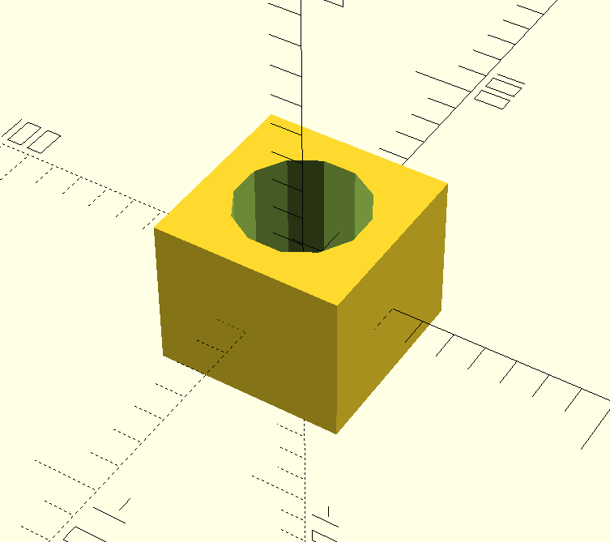

# Scene props

This repository contains models in `OpenSCAD` and `STL` formats for manipulation problems.

## Peg in hole


### Insertion box


- It is hard to accurately cut the model into pieces with [O3DE's Convex Decompostion](https://www.docs.o3de.org/docs/learning-guide/tutorials/assets/physx-colliders/#convex-decomposition) for PhsyX engine (it is realized by [V-HACD library](https://github.com/kmammou/v-hacd)).

### Single insertion box 


### Peg - uniform prism


### Info
- These models are made with OpenSCAD software. 
- By default, all metrics are unitless. Assume that **1 unit equals 1 mm**.
- Tolerances selected for holes are `5` and `10` mm.
- Source `*.scad` files are in `src` directory.
- Re-create models in `meshes` dir with bash scripts, i.e.:

```bash
cd ./peg_in_hole
./generate_pegs.sh
./generate_holes.sh
./generate_holes_array.sh
```

## Requirements
```bash
sudo apt insatall openscad
```