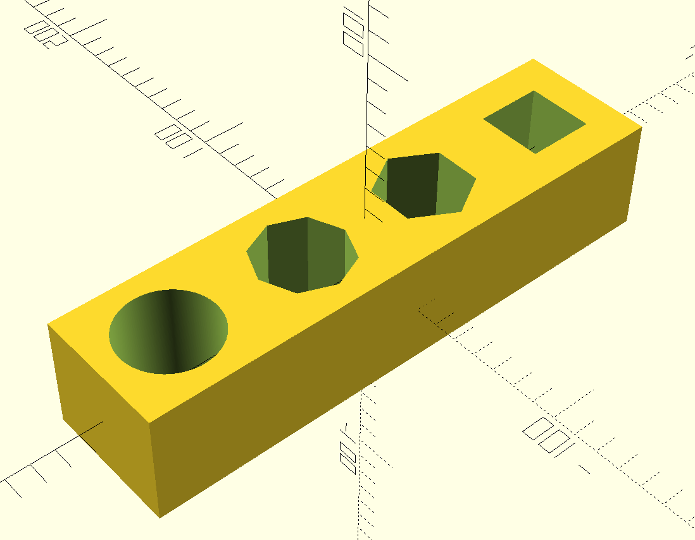
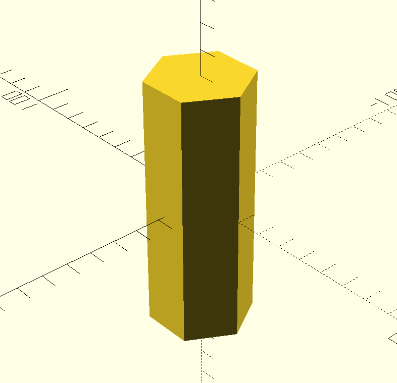

# Scene props

This repository contains models in `OpenSCAD` and `STL` formats for manipulation problems.

## Peg in hole




```bash
./peg_in_hole
```
These models are made with OpenSCAD software. By default, all metrics are unitless. Assume that **1 unit equals 1 mm**.

- Re-create models in `meshes` dir with bash scripts.
- Source `*.scad` files are in `src` directory.

## Requirements
```bash
sudo apt insatall openscad
```